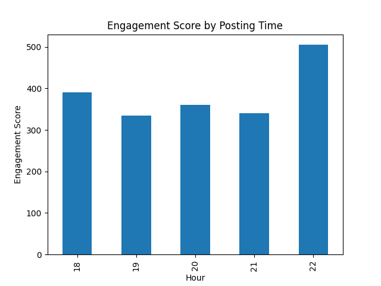

# Social Media Content Analytics & Recommendation System

## Overview

This project analyzes social media post performance using Python.  
It evaluates engagement patterns based on topic, platform, and posting time.

The system processes post data and calculates an **engagement score** using likes and comments.

## Features

- Engagement score calculation
- Topic performance analysis
- Platform comparison
- Posting time analysis
- Keyword analysis
- Content recommendation

## Project Structure

```
social-media-content-analytics
│
├─ charts/
│   ├─ platform_engagement.png
│   ├─ time_engagement.png
│   └─ topic_engagement.png
│
├─ data/
│   └─ posts.csv
│
├─ analysis.py
├─ keyword_analysis.py
├─ recommendation.py
├─ visualization.py
└─ README.md
```

## Example Visualization

Example analysis of engagement by posting time:



## Technologies Used

- Python
- Pandas
- Matplotlib

## How to Run

Clone the repository:

```
git clone https://github.com/522pengzhen-lang/social-media-content-analytics.git
```

Install dependencies:

```
pip install pandas matplotlib
```

Run the analysis:

```
python visualization.py
```

## Author

Pengzhen Lang
